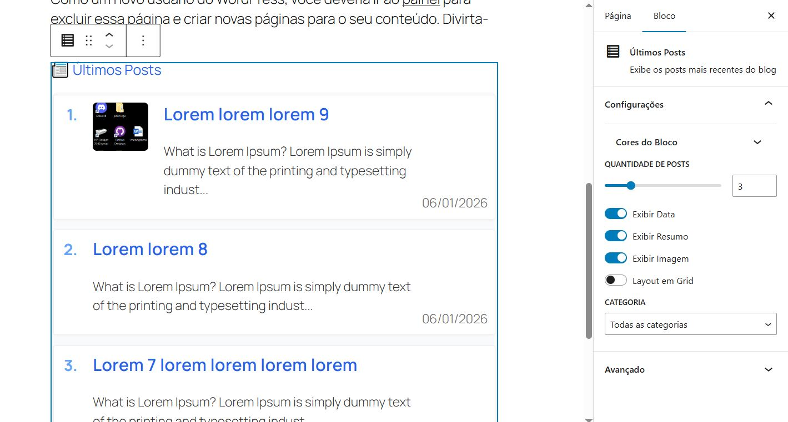

#  Meu Bloco Dinâmico "Últimos Posts"

Um plugin WordPress que adiciona um bloco dinâmico ao editor Gutenberg para exibir os posts mais recentes do seu site, com visual moderno e opções de personalização.

##  Funcionalidades

- Exibe os últimos posts do blog em lista ou grid
- Opções para mostrar/ocultar data, resumo, imagem e categoria
- Personalização de cores (fundo, cards, título, resumo, data)
- Layout responsivo e visual consistente no editor e frontend
- Totalmente dinâmico: conteúdo atualizado automaticamente

##  Estrutura do Projeto

```
meu-bloco-dinamico/
├── assets/                     # Imagens e recursos estáticos
│   └── bloco-dinamico.JPG
├── build/                      # Arquivos gerados pelo build (não versionar)
│   ├── block.json
│   ├── index.asset.php
│   ├── index.css
│   ├── index.js
│   └── style-index.css
├── node_modules/               # Dependências do npm (não versionar)
├── src/                        # Código-fonte do bloco
│   ├── block.json              # Definições do bloco Gutenberg
│   ├── editor.scss             # Estilos do editor
│   ├── index.js                # Lógica do bloco (React)
│   └── style.scss              # Estilos do frontend
├── .gitignore                  # Arquivos/pastas ignorados pelo git
├── exercicio-bloco-dinamico-wordpress.md # Exercício/guia
├── meu-bloco-dinamico.php      # Arquivo principal do plugin
├── package.json                # Configuração do npm/scripts
├── package-lock.json           # Lockfile do npm
└── README.md                   # Documentação do projeto
```

##  Instalação

1. Faça o download ou clone este repositório.
2. Copie a pasta `meu-bloco-dinamico` para `wp-content/plugins` do seu WordPress.
3. No terminal, navegue até a pasta do plugin e execute:

   ```bash
   npm install
   npm run build
   ```

4. Ative o plugin no painel do WordPress.

##  Como Usar

1. No editor de blocos do WordPress, procure por "Últimos Posts".
2. Adicione o bloco à sua página ou post.
3. Use a barra lateral para personalizar quantidade, layout, cores e exibição de informações.
4. Visualize o resultado no editor e no frontend.

## Exemplo Visual




